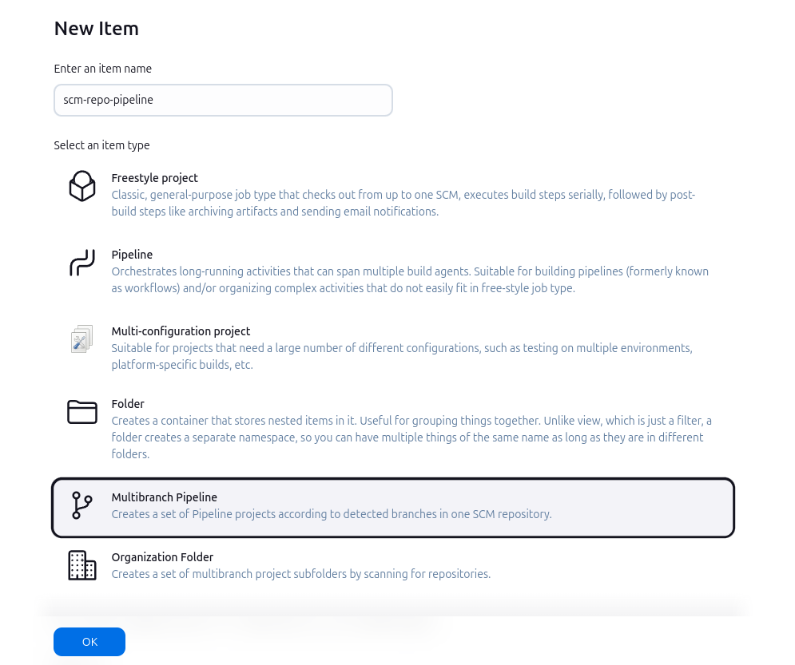
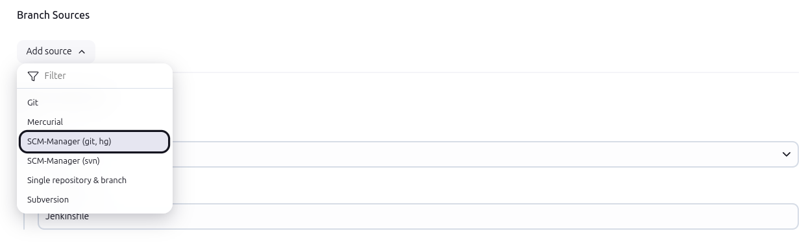
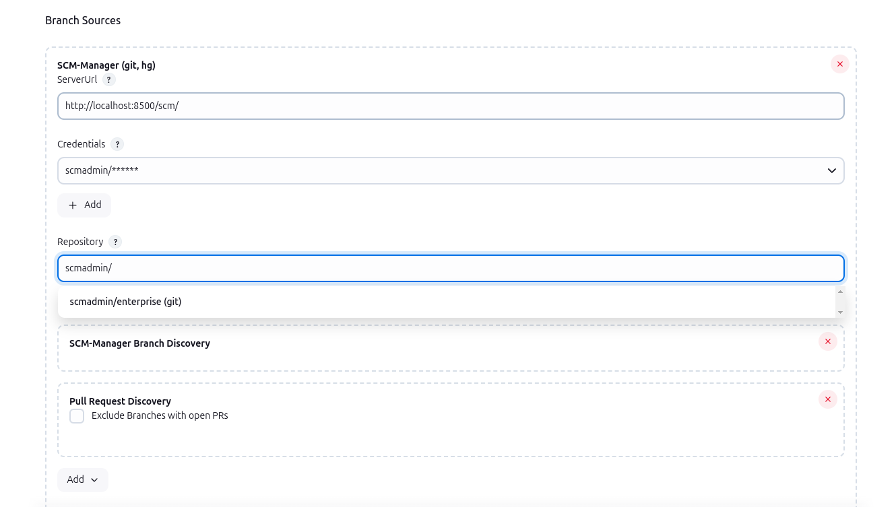
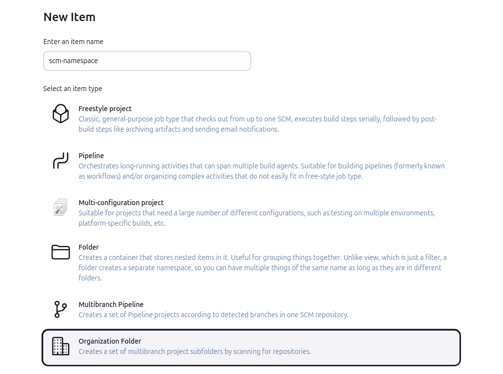
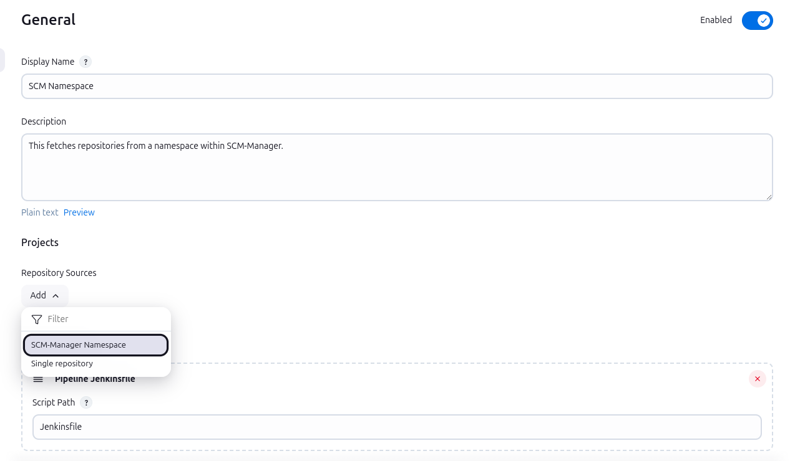
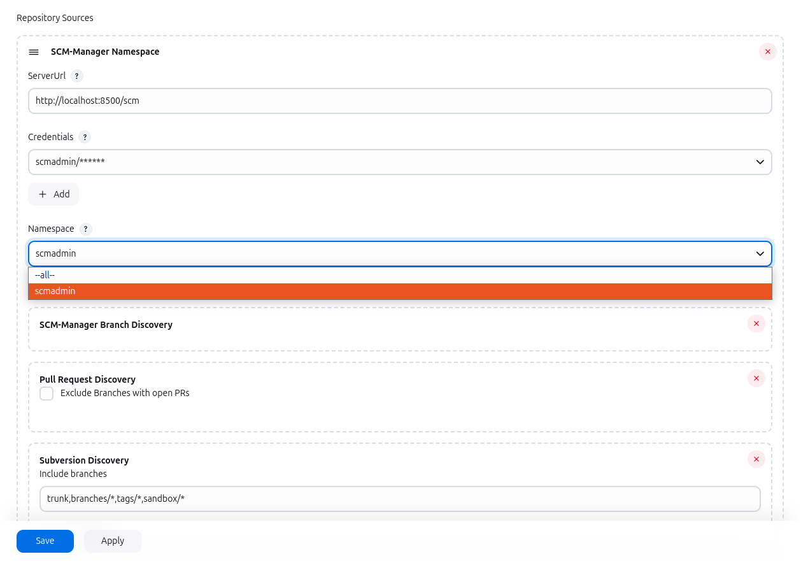

# SCM-Manager Plugin
[](https://ci.jenkins.io/job/Plugins/job/scm-manager-plugin/job/master/)
[](LICENSE)

<br />
<div align="center">
  <a href="https://www.scm-manager.org/">
    
  </a>

<h3 align="center">SCM-Manager Plugin</h3>

  <p align="center">
    Integrate your repositories from different SCM with this plugin!
  </p>
    <p><b>Note:</b> This plugin requires SCM-Manager in order to be useful. Feel free to check it out in case you haven't been used to it yet.</p>
    <a href="https://www.scm-manager.org/download/"><strong>Download/Install latest SCM-Manager version »</strong></a>
    <br />
    <br />
    <a href="https://github.com/jenkinsci/scm-manager-plugin/blob/master/docs/de/index.md">Documentation in German</a>
</div>

## Requirements

For full functionality, this plugin requires SCM-Manager v3 (see above) with an installed
[Jenkins plugin](https://www.scm-manager.org/plugins/scm-jenkins-plugin/) for the triggers and the
[CI plugin](https://www.scm-manager.org/plugins/scm-ci-plugin/) to show the build results inside SCM-Manager. To create
SSH connection between Jenkins and SCM-Manager, you can use the
[SSH plugin](https://www.scm-manager.org/plugins/scm-ssh-plugin/).
Additionally, if you want to enrich the environment variables of a build with the custom properties of SCM-Manager Repository, 
you are also required to install the [Custom Properties plugin](https://scm-manager.org/plugins/scm-custom-properties-plugin/) and the [Pipeline: Basic Steps Plugin](https://plugins.jenkins.io/workflow-basic-steps/).

## Description
This plugin gives various ways to connect your SCM-Manager with Jenkins, like sending build status, multibranch
pipelines, folders for complete namespaces, and navigation items.

### Build Status
Once the plugin is installed, it will automatically detect whether any jobs have configured an scm pointing to an instance of an SCM-Manager. 
If such a build job starts, the plugin will send the `PENDING` state for the checkout revision to SCM-Manager. 
After the build is complete, the plugin will send the resulting state to SCM-Manager (`SUCCESS`, `UNSTABLE` or `FAILURE`).

### Multibranch Pipelines
For multibranch pipelines, there is a new branch source named "SCM-Manager". 
You can create pipelines in Jenkins that can find branches, tags, and pull requests in SCM-Manager hosted repositories on their own. 
In cooperation with the [Jenkins plugin](https://www.scm-manager.org/plugins/scm-jenkins-plugin/) in SCM-Manager, the Jenkins CI server will receive hooks on every change and trigger new builds.
To remove stale jobs like for no longer available repositories, you can manually execute "Scan Namespace Now".

To create such a pipeline, select "New Item" on the Jenkins top level page, then enter a name and select "Multibranch
Pipeline".



In the configuration form for this item, select the matching "SCM-Manager" entry for your repository type in the "Add
source" dropdown in the section "Branch Sources".



In the new configuration, enter the base URL of your SCM-Manager instance and select according credentials. 
This plugin will then load a list of all available repositories you can select from.
You may also copy and paste a repository into the field.



Finally, you can select behaviours where you can choose whether branches, tags or pull requests shall be built (among others).

#### JobDSL

In order to create an SCM-Manager Mercurial or Git repository with the Jenkins JobDSL, the following syntax can be used:

```groovy
multibranchPipelineJob('heart-of-gold') {
  branchSources {
    scmManager {
      id('spaceships/heart-of-gold')
      serverUrl('https://scm.hitchhiker.com')
      credentialsId('my-secret-id')
      repository('spaceships/heart-of-gold')
      discoverBranches(true)
      discoverPullRequest(true)
      discoverTags(false)
    }
  }
}
```

The parameters `discoverBranches`, `discoverPullRequest` and `discoverTags` are optional 
and describe which heads of the repository are build.
The example shows the default values.

Have a look at the following example for a Subversion repository:

```groovy
multibranchPipelineJob('heart-of-gold') {
  branchSources {
    scmManagerSvn {
      id('spaceships/heart-of-gold')
      serverUrl('https://scm.hitchhiker.com')
      credentialsId('my-secret-id')
      repository('spaceships/heart-of-gold')
      includes("trunk,branches/*,tags/*,sandbox/*")
      excludes("")
    }
  }
}
```

#### Custom Properties

The SCM-Manager Plugin custom properties allows users to define additional properties for each repository, with a key-value structure.
Those properties will be injected as an environment variable into each multi brach pipeline build, if it uses the SCM-Manager as its source.
The environment variables will always be named with the same scheme. 
It starts with the prefix `SCMM_CUSTOM_PROP_` and will end with the key of the custom property.
For example the custom property with the key `lang`, will be injected as the environment variable `SCMM_CUSTOM_PROP_lang`.
The value of the environment variable, will be the value of the custom property.

### Organization Folders &ndash; Namespaces
If you want to have build jobs for every repository in a namespace, you can create "SCM-Manager Namespace" jobs. These
will scan all repositories in the given namespace and create multibranch pipelines for each repository where a
`Jenkinsfile` can be found. If a new repository is created in this namespace, a new pipeline will be created
automatically.

To create such a folder for a complete namespace, select "New Item" on the Jenkins top level page, then enter a name
and select "Organization Folder".



In the configuration form for this item, select the *Repository&nbsp;Sources > Add* button and choose *SCM-Manager Namespace*.



Within the new form, enter the base URL of your SCM-Manager instance and select according
credentials. This plugin will then load a list of all available namespaces you can select from.

As an alternative to a concrete namespace, you can select <code>--all--</code> if you want to create build jobs for
all repositories of the whole SCM-Manager instance. Please note that in this case, the folders for the jobs will be
named with the pattern *namespace/name*.



Finally, you can select behaviours where you can choose whether (for example) branches, tags or pull requests shall be
built.

#### JobDSL

Have a look at the following example in order to create a build job for an SCM-Manager namespace with the JobDSL:

```groovy
organizationFolder("spaceships") {
  organizations {
    scmManagerNamespace {
      serverUrl('https://scm.hitchhiker.com')
      credentialsId('my-secret-id')
      namespace("spaceships")
      discoverBranches(true)
      discoverPullRequest(true)
      discoverTags(false)
      discoverSvn {
        includes("trunk,branches/*,tags/*,sandbox/*")
        excludes("")
      }
    }
  }
}
// scan namespace directly after creation
queue("spaceships")
```

The `discover*` parameters are optional, the example above shows the default values. 
To disable subversion builds, a `false` can be passed to the `discoverSvn` method e.g.: `discoverSvn(false)`.
To build all namespaces of the SCM-Manager instance, the pseudo namespace `--all--` can be used.

### Navigation
In different pages of Jenkins, you can find links to the corresponding SCM-Manager page:

- In **multibranch pipelines**, you can find the link "SCM-Manager" in the main navigation on the left. This leads you
  directly to the main page of the repository in SCM-Manager.
- In a **job for a concrete branch** or a **tag**, the link "SCM-Manager" in the main navigation on the left will get you
  directly to the sources in SCM-Manager for this branch or tag.
- In a **job for a pull request**, the link "SCM-Manager" in the main navigation on the left will navigate to the pull
  request in SCM-Manager.
- From the page for a build result, the link "SCM-Manager" in the main navigation on the left leads to the **Sources**
  view in SCM-Manager for the concrete revision that has been built.
- In the **Changes** view, there are links that lead to the details of a change showing the authors, the commit message,
  and the diff for the commit.

## Development
### Build

To build the plugin just run the maven package phase.

```bash
mvn package
```

### Local Jenkins Instance

Start the local Jenkins instance:

```bash
mvn hpi:run
```

### Plugin Update
At times, it may become necessary to update the Jenkins version of this
plugin. Take following steps into account:

* On mvnrepository - io.jenkins.tools.bom, pick the LTS version you want to update this plugin to.
You can see all available LTS BOMs in [this list on mvnrepository.com](https://mvnrepository.com/artifact/io.jenkins.tools.bom).
  * Enter the values into the io.jenkins.tools.bom:bom-{version} dependency.
* Manually update the versions listed in the properties section. You can pick the version numbers from the respective artifact list of
the BOM version on mvnrepository.com.
* Also consider to update the version of org.jenkins-ci.plugins:plugin (the parent).
Check out the latest version [here](https://mvnrepository.com/artifact/org.jenkins-ci.plugins/plugin).
