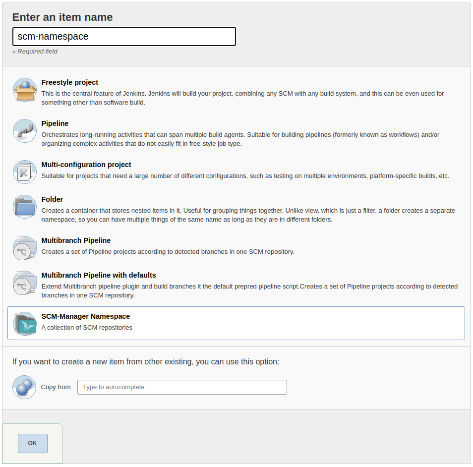

# SCM-Manager Plugin
[](https://ci.jenkins.io/job/Plugins/job/scm-manager-plugin/job/master/)
[](LICENSE)

Jenkins [SCM-Manager 2](https://www.scm-manager.org/) Plugin

## Description

This plugin has the following features:

- Once the plugin is installed, it will automatically detect jobs which have configured scm that points to an instance
   of SCM-Manager v2.
   If such a build job stars, the plugin will send the `PENDING` state for the checkout revision to SCM-Manager.
   After the build is complete the plugin will send the resulting state to SCM-Manager (`SUCCESS`, `UNSTABLE` or `FAILURE`).
- For multibranch pipelines there is a new branch source named "SCM-Manager", so you can create pipelines in Jenkins that
   can find branches, tags and pull requests in SCM-Manager hosted repositories on their own. In cooperation with the
   [jenkins plugin](https://www.scm-manager.org/plugins/scm-jenkins-plugin/) in SCM-Manager Jenkins will receive hooks on
   every change and trigger new builds.
   To remove jobs for no longer available repositories, you can manualle select "Scan Namespace Now".
   
   To create such a pipeline, select "New Item" on the Jenkins top level page, then enter a name and select "Multibranch
   Pipeline".
   
   In the configuration form for this item, select the matching "SCM-Manager" entry for your repository type in the "Add
   source" dropdown in the section "Branch Sources".
   
   In the new configuration enter the base URL of your SCM-Manager instance and select according credentials. This
   plugin will then load a list of all available repositories you can select from.
   
   Finally you can select behaviours where you can choose for example, whether branches, tags or pull requests shall be
   build.
- If you want to have build jobs for every repository in a namespace, you can create "SCM-Manager namespace" jobs. These
   will scan all repositories in the given namespace and create multibranch pipelines for each repository where a
   `Jenkinsfile` can be found. If a new repository is created in this namespace, a new pipeline will be created
   automatically.
   
   To create such a folder for a complete namespace, select "New Item" on the Jenkins top level page, then enter a name
   and select "SCM-Manager Namespace".
   
   In the configuration form for this item, enter the base URL of your SCM-Manager instance and select according
   credentials. This plugin will then load a list of all available namespaces you can select from.
   
   Finally you can select behaviours where you can choose for example, whether branches, tags or pull requests shall be
   build.

## Requirements

For full functionality, this plugin requires SCM-Manager v2 with an installed
[jenkins plugin](https://www.scm-manager.org/plugins/scm-jenkins-plugin/).

## Build

To build the plugin just run the maven package phase.

```bash
mvn package
```

## Development 

Start the local Jenkins instance:

```bash
mvn hpi:run
```
