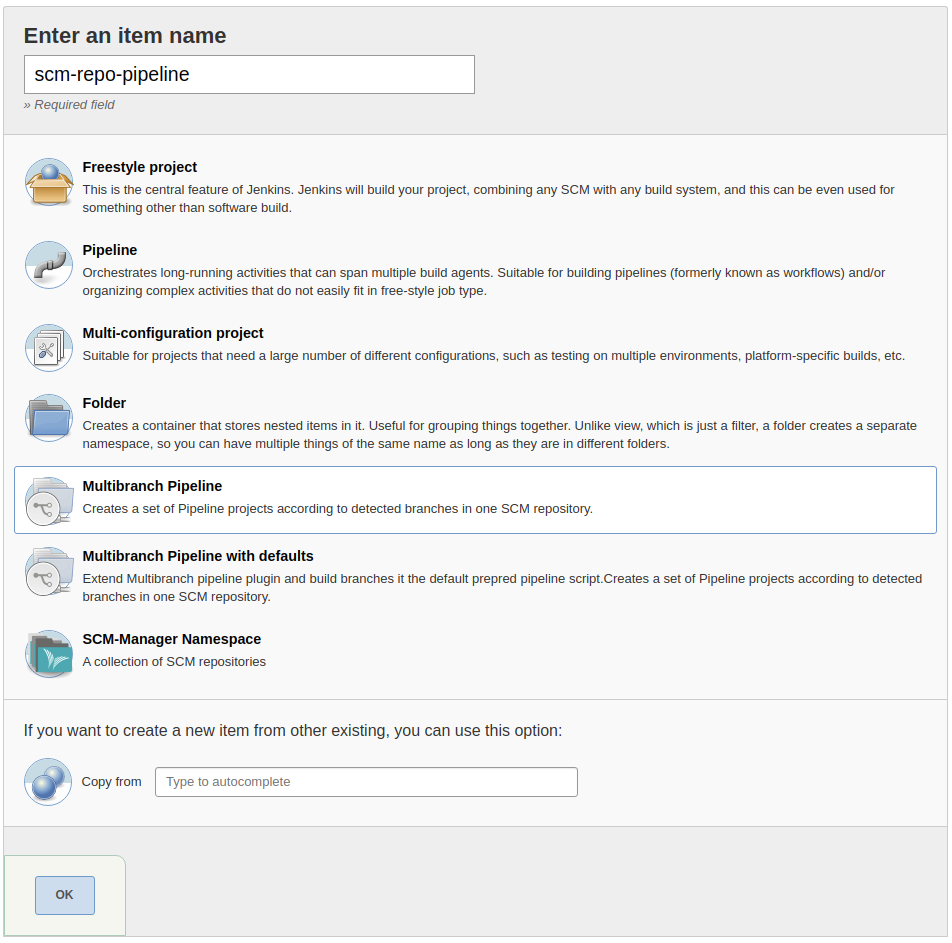
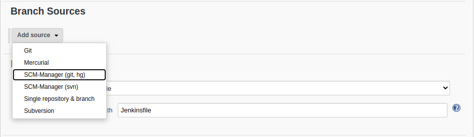
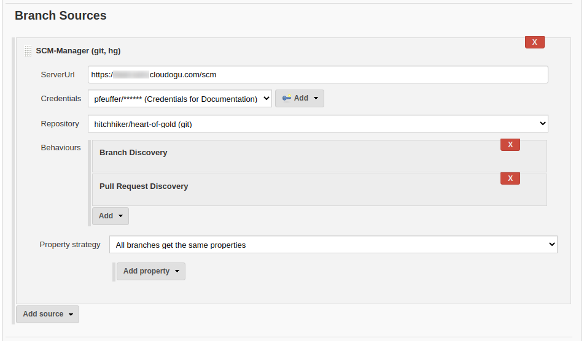
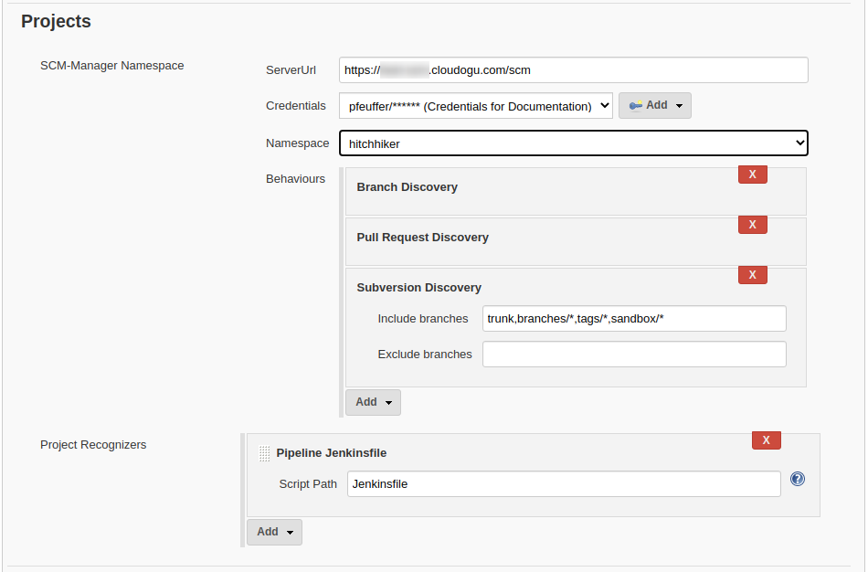

# SCM-Manager Plugin
[](https://ci.jenkins.io/job/Plugins/job/scm-manager-plugin/job/master/)
[](LICENSE)

Jenkins [SCM-Manager 2](https://www.scm-manager.org/) Plugin

## Description

This plugin gives various ways to connect your SCM-Manager with Jenkins, like sending build status, multibranch
pipelines, folders for complete namespaces and navigation items.

### Build Status
Once the plugin is installed, it will automatically detect jobs which have configured scm that points to an instance
of SCM-Manager v2. If such a build job stars, the plugin will send the `PENDING` state for the checkout revision to
SCM-Manager. After the build is complete the plugin will send the resulting state to SCM-Manager (`SUCCESS`, `UNSTABLE`
or `FAILURE`).

### Multibranch Pipelines
For multibranch pipelines there is a new branch source named "SCM-Manager", so you can create pipelines in Jenkins that
can find branches, tags and pull requests in SCM-Manager hosted repositories on their own. In cooperation with the
[jenkins plugin](https://www.scm-manager.org/plugins/scm-jenkins-plugin/) in SCM-Manager Jenkins will receive hooks on
every change and trigger new builds.
To remove jobs for no longer available repositories, you can manualle select "Scan Namespace Now".

To create such a pipeline, select "New Item" on the Jenkins top level page, then enter a name and select "Multibranch
Pipeline".

In the configuration form for this item, select the matching "SCM-Manager" entry for your repository type in the "Add
source" dropdown in the section "Branch Sources".

In the new configuration enter the base URL of your SCM-Manager instance and select according credentials. This
plugin will then load a list of all available repositories you can select from.

Finally you can select behaviours where you can choose for example, whether branches, tags or pull requests shall be
build.

### Namespaces
If you want to have build jobs for every repository in a namespace, you can create "SCM-Manager namespace" jobs. These
will scan all repositories in the given namespace and create multibranch pipelines for each repository where a
`Jenkinsfile` can be found. If a new repository is created in this namespace, a new pipeline will be created
automatically.

To create such a folder for a complete namespace, select "New Item" on the Jenkins top level page, then enter a name
and select "SCM-Manager Namespace".

In the configuration form for this item, enter the base URL of your SCM-Manager instance and select according
credentials. This plugin will then load a list of all available namespaces you can select from.

Finally you can select behaviours where you can choose for example, whether branches, tags or pull requests shall be
build.

### Navigation
In different pages of Jenkins you can find links to the corresponding SCM-Manager page:

- In multibranch pipelines you can find the link "SCM-Manager" in the main navigation on the left. This leads you
  directly to the main page of the repository in SCM-Manager.
- In a job for a concrete branch or a tag the link "SCM-Manager" in the main navigation on the left will get you
  directly to the sources in SCM-Manager for this branch or tag.
- In a job for a pull request the link "SCM-Manager" in the main navigation on the left will navigate to the pull
  request in SCM-Manager.
- From the page for a build result the link "SCM-Manager" in the main navigation on the left leads to the sources
  view in SCM-Manager for the concrete revision that has been build.
- In the "Changes" view there are links that lead to the details of a change showing the authors, the commit message
  and the diff for the commit.

## Requirements

For full functionality, this plugin requires SCM-Manager v2 with an installed
[jenkins plugin](https://www.scm-manager.org/plugins/scm-jenkins-plugin/) for the triggers and the
[CI plugin](https://www.scm-manager.org/plugins/scm-ci-plugin/) to show the build results inside SCM-Manager.

## Build

To build the plugin just run the maven package phase.

```bash
mvn package
```

## Development 

Start the local Jenkins instance:

```bash
mvn hpi:run
```
