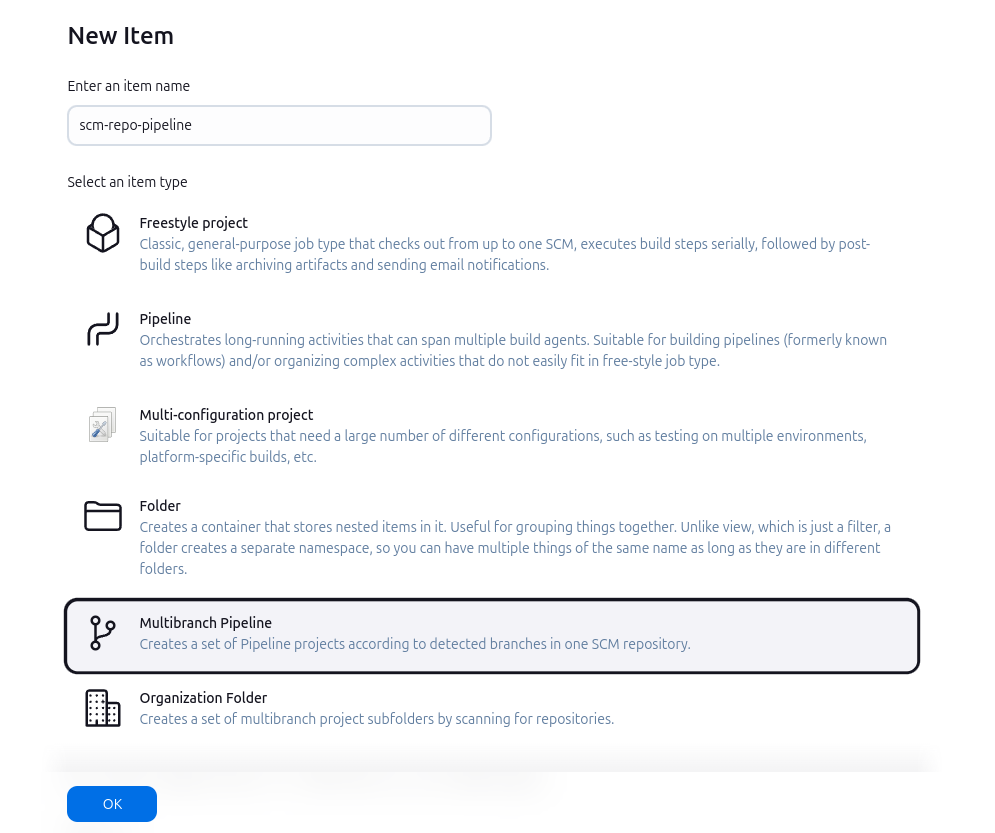
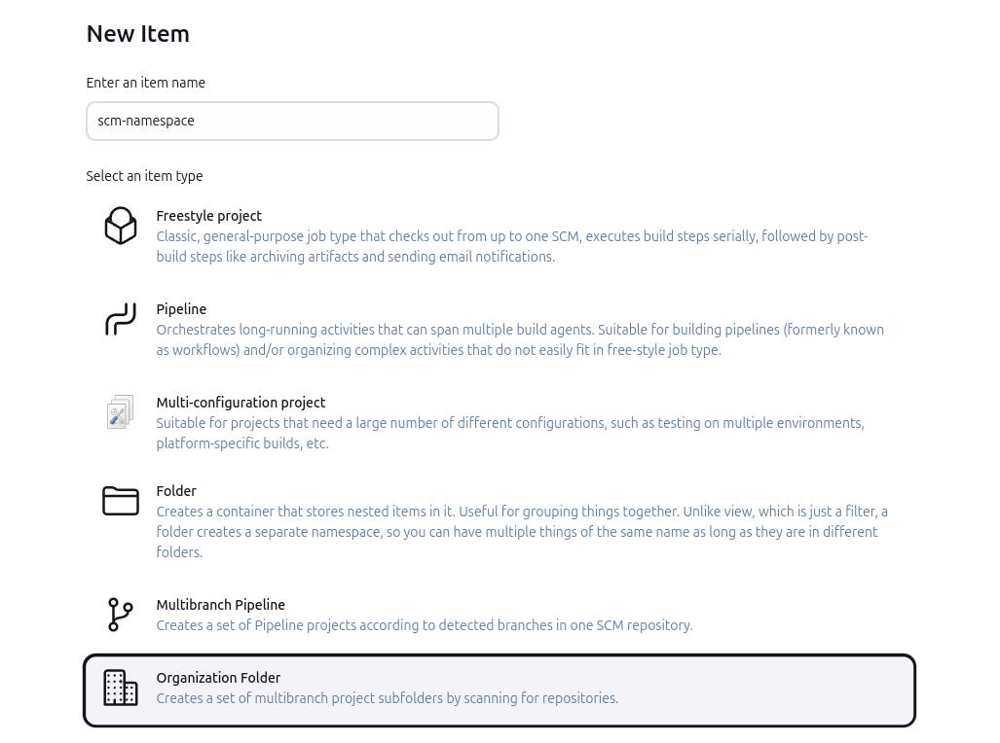
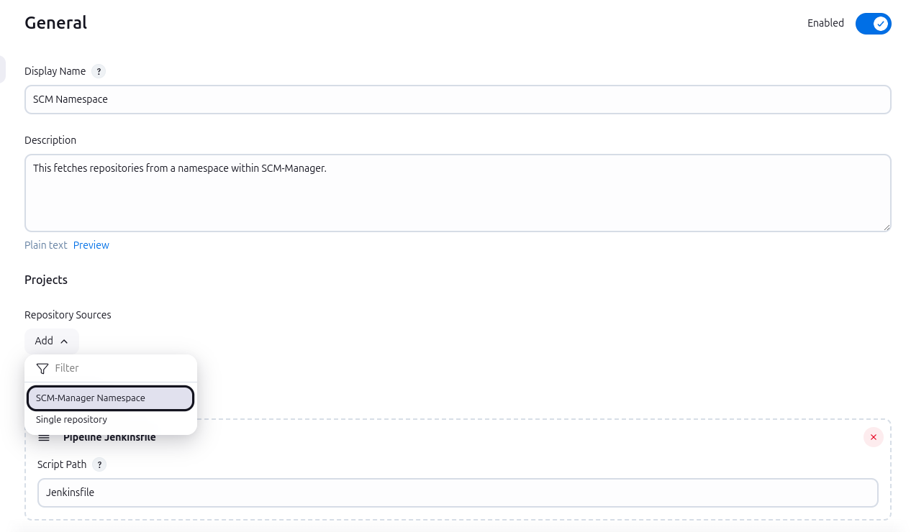

Das SCM-Manager-Plugin für den Jenkins bietet mehrere Möglichkeiten der Kommunikation eines SCM-Managers mit Jenkins. 
Hierzu zählt:
* die Anzeige von Ergebnissen der Builds
* der Einsatz von *Multibranch Pipelines* für einzelne Repositories
* Ordner (*Organization Folder*) für komplette Namespaces und verschiedene Navigationen.

### Buildergebnisse
Sobald das Plugin im Jenkins installiert wurde, werden automatisch Jobs erkannt, welche den SCM-Manager nutzen.
Startet ein solcher Job, sendet das Plugin einen `PENDING` Status für die entsprechende Revision an den SCM-Manager.
Nachdem der Build Job abgeschlossen ist, wird das Ergebnis als Status an den SCM-Manager gesendet (`SUCCESS`, `UNSTABLE`
oder `FAILURE`).

### Multibranch-Pipelines
Für sog. **Multibranch-Pipelines** gibt es eine neue Branch-Source namens SCM-Manager. Über diese können Pipelines in 
Jenkins erstellt werden, die selbständig Branches, Tags und Pull-Requests in Repositorys finden, die im SCM-Manager
verwaltet werden. Im Zusammenspiel mit dem [Jenkins-Plugin](https://www.scm-manager.org/plugins/scm-jenkins-plugin/) im SCM-Manager erhält Jenkins sog. *Hooks*
bei jeder relevanten Änderungen und stößt neue Builds an.

Um eine solche Pipeline zu erstellen, muss zunächst **New Item** auf der Startseite von Jenkins gewählt werden. Danach
muss ein Name eingetragen und der Typ **Multibranch Pipeline** gewählt werden.



In der darauffolgenden Konfiguration muss im Abschnitt **Branch Sources** über das Dropdown **Add source** der zu dem Typen des Repositorys passende "SCM-Manager"-Eintrag gewählt werden.


In dem neuen Abschnitt kann nun die Base-URL der SCM-Manager-Instanz eingetragen sowie die passende Authentifizierung gewählt werden. 
Anschließend wird eine Liste aller zur Verfügung stehenden Repositorys geladen, von denen eines gewählt
werden muss. 
Alternativ kann eine schon vorhandene **Namespace/Repository**-Namenskombination in das Feld frei eingefügt werden.


Zum Abschluss können verschiedene Verhaltensweisen gewählt und konfiguriert werden, wie z. B. ob Branches, Tags oder
Pull-Requests gebaut werden sollen.

#### JobDSL

Um ein Build Job für ein SCM-Manager-Repository mithilfe der JobDSL anzulegen, 
kann folgende Syntax für Mercurial- und Git-Repositorys verwendet werden:

```groovy
multibranchPipelineJob('heart-of-gold') {
  branchSources {
    scmManager {
      id('spaceships/heart-of-gold')
      serverUrl('https://scm.hitchhiker.com')
      credentialsId('my-secret-id')
      repository('spaceships/heart-of-gold')
      discoverBranches(true)
      discoverPullRequest(true)
      discoverTags(false)
    }
  }
}
```

Die Parameter `discoverBranches`, `discoverPullRequest` und `discoverTags` sind optional und bilden ab, welche Typen gebaut werden sollen.
Das Beispiel zeigt die Standardwerte.

Die Syntax für ein Subversion-Repository zeigt folgendes Beispiel:

```groovy
multibranchPipelineJob('heart-of-gold') {
  branchSources {
    scmManagerSvn {
      id('spaceships/heart-of-gold')
      serverUrl('https://scm.hitchhiker.com')
      credentialsId('my-secret-id')
      repository('spaceships/heart-of-gold')
      includes("trunk,branches/*,tags/*,sandbox/*")
      excludes("")
    }
  }
}
```

Die Parameter für `includes` und `excludes` sind ebenfalls optional und mit ihnen kann bestimmt werden, 
welche Ordner des Repositorys gebaut werden.
Das Beispiel zeigt die Standardwerte.

### Organization Folders &ndash; Namespaces
Sollen für alle Repositorys eines **kompletten Namespaces** im SCM-Manager Jobs erzeugt werden, kann ein **Organization Folder**-Job mit einem SCM-Manager-Namespace als Quelle genutzt werden. 
Dieser prüft alle Repositorys in einem gegebenen Namespace und erzeugt entsprechende Multibranch-Pipelines, wenn im Wurzelverzeichnis des Repositorys eine `Jenkinsfile` gefunden wurde. 
Wird in dem Namespace ein passendes neues Repository erzeugt, wird automatisch der dazugehörige Build-Job im Jenkins erstellt.
Um nicht mehr vorhandene Build-Jobs zu entfernen, kann manuell **Scan Namespace Now** gestartet werden.

Um einen solchen Ordner für einen kompletten Namespace zu erstellen, muss zunächst **New Item** auf der Startseitevon Jenkins gewählt werden. 
Danach kann ein Name eingetragen und der Punkt **Organization Folder** gewählt werden.



Im Einstellungsformular für das Item muss der Knopf **Repository&nbsp;Sources > Add** mit der Option **SCM-Manager Namespace**
ausgewählt werden.



Innerhalb des Einstellungsformulars muss nun die Instanz-URL des SCM-Manager-Servers eingetragen und eine gültige Authentifizierung
gewählt werden. Das Plugin lädt daraufhin alle verfügbaren Namespaces, von denen einer gewählt werden kann.

Alternativ kann auch <code>--all--</code> ausgewählt werden, um für alle Repositorys der kompletten SCM-Manager-Instanz
Build-Jobs zu erstellen. In diesem Fall werden die Ordner für die Jobs nach dem Muster *namespace/name* benannt.


Abschließend können verschiedene Verhaltensweise gewählt und konfiguriert werden, wie z. B. ob Branches, Tags oder
Pull-Requests gebaut werden sollen.

#### JobDSL

Das folgende Beispiel zeigt die JobDSL, um einen Job für einen SCM-Manager-Namespace zu erstellen:

```groovy
organizationFolder("spaceships") {
  organizations {
    scmManagerNamespace {
      serverUrl('https://scm.hitchhiker.com')
      credentialsId('my-secret-id')
      namespace("spaceships")
      discoverBranches(true)
      discoverPullRequest(true)
      discoverTags(false)
      discoverSvn {
        includes("trunk,branches/*,tags/*,sandbox/*")
        excludes("")
      }
    }
  }
}
// scan namespace directly after creation
queue("spaceships")
```
Die `discover*`-Parameter sind optional und das Beispiel zeigt die Standardwerte.
Um Subversion-Builds zu deaktivieren, kann der `discoverSvn`-Methode ein `false` übergeben werden: `discoverSvn(false)`.
Um alle Namespaces zu bauen, kann der Pseudo-Namespace `--all--` verwendet werden.

### Navigation
Auf verschiedenen Seiten von Jenkins befinden sich Links zu entsprechenden Seiten im SCM-Manager:

- In **Multibranch Pipelines** befindet sich in der linken Hauptnavigation der Link "SCM-Manager". Dieser führt direkt
  auf die Hauptseite des Repositorys im SCM-Manager.
- In einem Job für einen konkreten Branch oder einen Tag führt der Link "SCM-Manager" in der linken Hauptnavigation
  zu der Anzeige der Quellen im SCM-Manager für diesen Branch bzw. Tag.
- In einem Job für einen Pull-Request führt der Link "SCM-Manager" in der linken Hauptnavigation zu dem Pull-Request
  im SCM-Manager.
- Auf der Seite für einen konkreten Build führt der Link "SCM-Manager" in der linken Hauptnavigation zu der Anzeige
  der Quellen für die konkrete Revision, die gebaut wurde.
- In der Anzeige der "Changes" befinden sich Links, die zu den Details einer Revision im SCM-Manager führen, wo die
  Autoren, die Commitnachricht sowie das Diff zu diesem Commit gezeigt werden.

## Voraussetzungen

Für die volle Funktionalität wird ein SCM-Manager mit installiertem
[Jenkins-Plugin](https://www.scm-manager.org/plugins/scm-jenkins-plugin/) für das automatische Starten der Builds sowie
dem [CI-Plugin](https://www.scm-manager.org/plugins/scm-ci-plugin/) zur Anzeige der Build-Status im SCM-Manager
benötigt. Zudem können mit dem [SSH-Plugin](https://www.scm-manager.org/plugins/scm-ssh-plugin/) Verbindungen zwischen
Jenkins und SCM-Manager per SSH erzeugt werden.
